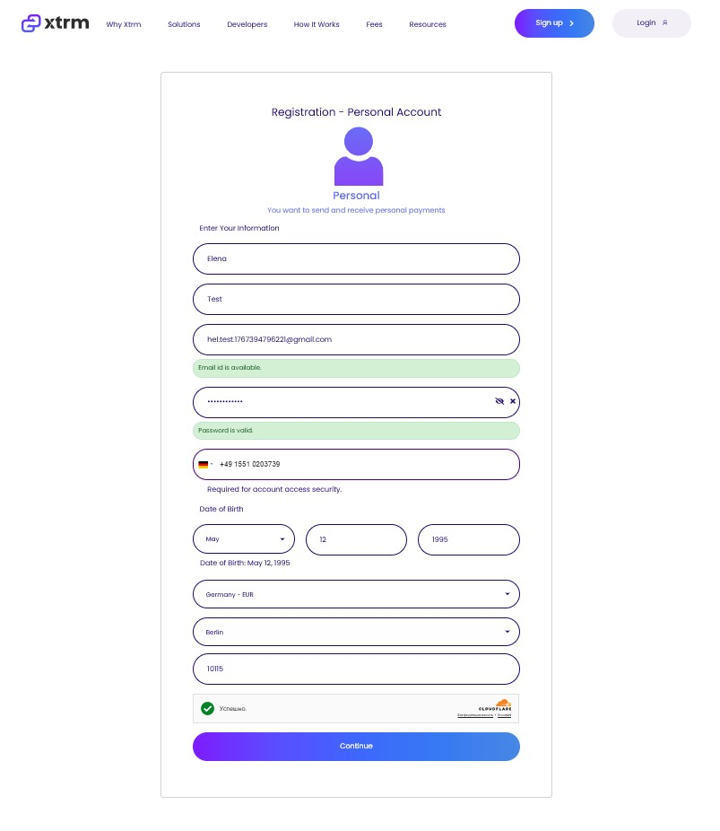
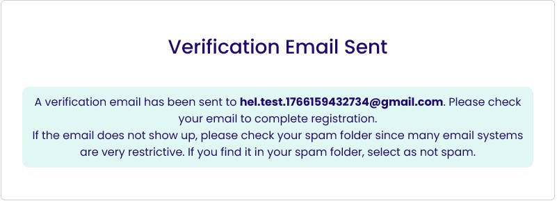
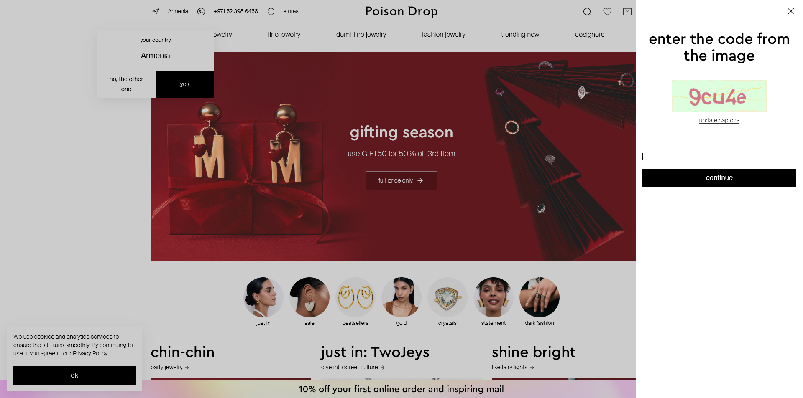
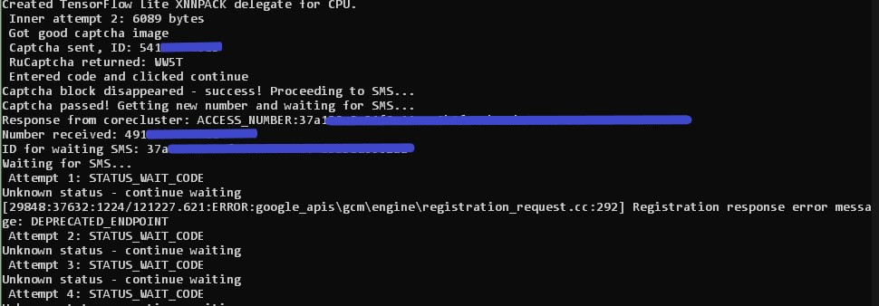

# Automation Case Study: Registration & Verification Pipelines


This repository contains a collection of automation scripts developed as part of a technical assessment. It demonstrates the ability to handle complex web interaction scenarios, including dynamic form filling, captcha solving, proxy authentication, and SMS verification flows.

---

## 📂 Project Structure

- **`task_1_xtrm/`**: Automation for a React-based registration form using SeleniumBase (Undetected Chromedriver).
- **`task_2_poisondrop/`**: Full-cycle SMS verification pipeline involving Proxy (Manifest V3), RuCaptcha, and CoreCluster API.
- **`assets/`**: Project screenshots and demonstrations.

---

## 🛠 Tech Stack & Features

| Feature | Technologies / Methods Used |
| :--- | :--- |
| **Browser Automation** | Selenium, SeleniumBase (UC Mode) |
| **Proxy Auth** | Custom Chrome Extension (Manifest V3) for seamless auth |
| **Captcha Solving** | Integration with RuCaptcha API (Text Captcha) |
| **SMS Verification** | Integration with CoreCluster API (OTP handling) |
| **Error Handling** | Robust logging and artifact saving (screenshots/HTML on failure) |

---

## 🚀 Task 1: XTRM Registration

**Goal:** Automate the registration process on a dynamic web application (`xtrm.com`), handling specific React input events and anti-bot detection.

**Key Highlights:**
- Uses `SeleniumBase` to bypass basic bot detection.
- Implements secure input filling via JavaScript injection (`safe_fill`) to trigger React `input`/`change` events correctly.
- Handles complex dropdowns and shadow DOM elements.



*(Screenshot of the automated form filling process)*

---

## 📱 Task 2: SMS Verification Pipeline

**Goal:** Automate account creation on `poisondrop.com` requiring phone verification, proxy rotation, and captcha solving.

**Key Highlights:**
- **Proxy Authentication:** Generates a dynamic Chrome Extension (Manifest V3) on runtime to handle HTTP proxies with login/password.
- **Resilience:** Implements a retry loop (get number -> try register -> solve captcha -> wait for SMS).
- **Diagnostics:** Automatically saves screenshots and HTML dumps in `artifacts/` if an error occurs.
- **Security:** Uses environment variables for API keys.



*(Log output showing successful number acquisition and SMS code entry)*

---

## ⚙️ Installation & Setup

### 1. Clone the repository
```bash
git clone https://github.com/your-username/automation-case-sms.git
cd automation-case-sms
```
### 2. Create a Virtual Environment
It is recommended to use a virtual environment to manage dependencies.

Windows:
```bash
python -m venv venv
venv\Scripts\activate
```

macOS / Linux:
```bash
python3 -m venv venv
source venv/bin/activate
```

### 3. Install Dependencies
```bash
pip install --upgrade pip
pip install -r requirements.txt
```

### 4. Configuration (Crucial for Task 2)
Create a .env file in the root directory to store your API keys safely. 
You can use the provided example as a template:
```bash
cp .env.example .env
```

Open .env and fill in your details:
```
CORECLUSTER_API_KEY=your_key_here
RUCAPTCHA_KEY=your_key_here
PROXY_HOST=your_proxy_host
# ... etc
```

## ▶️ Usage
Running Task 1 (XTRM)
```bash
python task_1_xtrm/registration.py
```

Running Task 2 (PoisonDrop)
```bash
python task_2_poisondrop/sms_verifier.py
```

Check the console output for real-time logs. 
Artifacts (logs and debug screenshots) will be saved in task_2_poisondrop/artifacts/.

## 📝 License
This project is for educational and portfolio purposes.